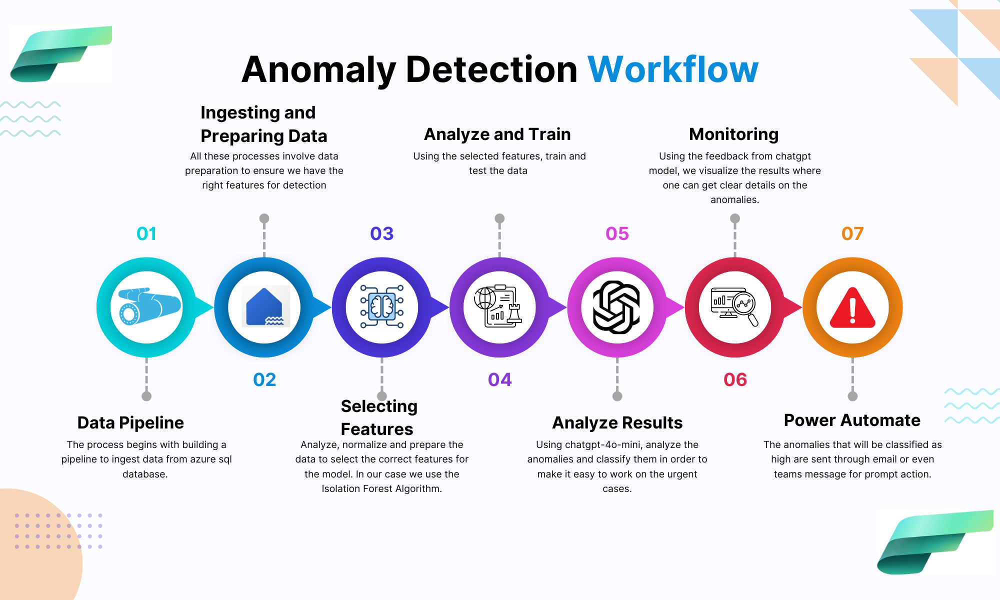
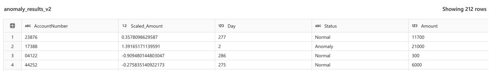
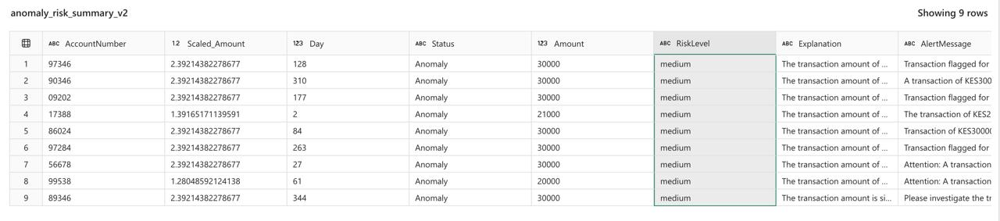
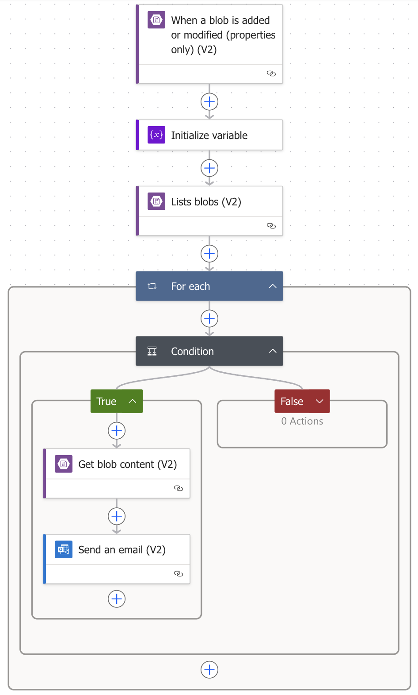
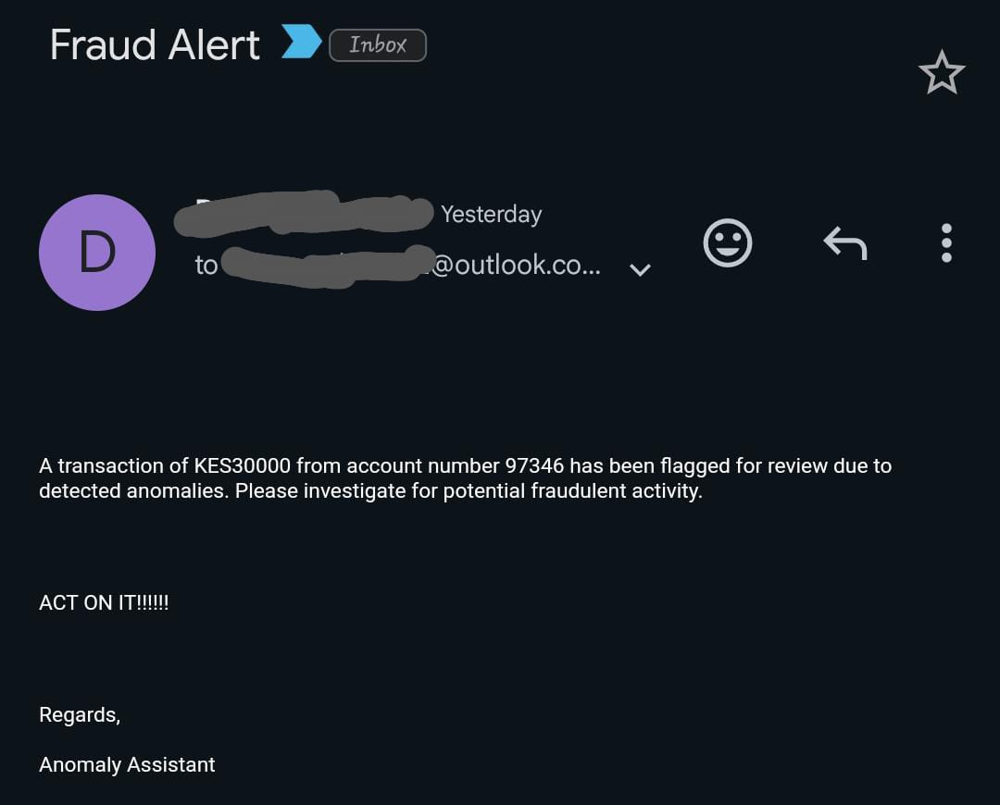

# Anomaly_Detection

### THE PROBLEM

Financial anomalies in Kenyan Institutions cost millions annually due to weak fraud detection systems. According to the CBK’s 2023 Fraud Report, fraud-related losses in Kenyan financial institutions surged by 21.3% in 2022, with internal fraud (e.g., transaction manipulation) accounting for 34% of cases (CBK, 2023). SACCOs—which serve over 14 million Kenyans (SASRA, 2023)—are particularly vulnerable, as manual audits and rule-based systems fail to detect sophisticated anomalies like transaction laundering or account takeovers. A 2022 study by the Kenya Bankers Association found that 68% of fraud cases were detected too late, with recovery rates below 15%. [This article](https://envestreetfinancial.com/kenyan-banks-lose-ksh36-6-million-to-insider-fraud-and-cybersecurity-lapses/#:~:text=In%20a%20concerning%20revelation%2C%20two%20prominent%20Kenyan%20banks,the%20persistent%20challenges%20within%20the%20nation%E2%80%99s%20banking%20sector) documents how one financial fraud involved three suspicious transactions totaling KSh 9.5 million, linked to a compromised employee machine, and another that saw Equity Bank lose KSh 1.5 billion in an insider-driven fraud with 47 unauthorized transactions.

These aren’t isolated incidents—they reveal a systemic challenge: the need for intelligent monitoring of financial transactions.

Sources:

-   Central Bank of Kenya (2023). Annual Fraud Report.
-   SASRA (2023). SACCO Supervision Report.
-   Kenya Bankers Association (2022). Fraud in the Banking Industry.

### SOLUTION OVERVIEW

This is a **Microsoft-Fabric-powered** solution, geared towards pin-pointing anomalies in financial institutional data. The main objective is built around **detection and automated alerting** (no predictions happening). Our solution uses advanced anomaly detection to flag unusual activity as it happens—before the damage is done. It’s lightweight, and integrates seamlessly into the financial institutions' existing systems, ensuring robust protection without slowing down services. From a high-level POV, once the transactions data is accessed, our solution runs the Machine Learning model, which detects anomalies, uses OpenAI's **GPT-4o-mini** to analyze and rank the anomalies in levels of (high/medium/low), generates an explanation for the deductions along with the alert message that contains the transaction info. After this, the high-risk anomalies are sorted out, added to text files that are automatically uploaded to **Azure Blob storage**. We have configured **Power Automate** to monitor the blob storage and additions or modifications of files triggers the email sending steps, prompting risk analysts to act on these anomalies.

#### The Solution Mind-Map:



### IMPLEMENTATION

On the Microsoft Fabric workspace, we have set up our **LakeHouse**. _The data is ingested from an Azure SQL DB_. After successfully ingesting the data (inside **PesaTransactionsV1** Lakehouse), we've created a notebook - `DetectAnomalies.ipynb` that sequentially executes the solution's main steps, which are:

#### 1. Train the model, test the data for anomalies.

-   First step here would be to read the data from the lakehouse table, create a data frame, then select and prepare the relevant features - in this case; transaction ammounts, the account numbers, the posting date.
-   Split the data to obtain reasonable chunks for training the model, and for the evaluation bit.
-   Train the model with the respective data. We chose the **Isolation Forest Algorithm** which you can read more about [on scikit-learn docs](https://scikit-learn.org/stable/modules/generated/sklearn.ensemble.IsolationForest.html). It is used conventionally due to its strengths in working with high-dimension datasets.
-   The model is then run on the test_data. Completion of this step is marked by an additional `Status` column on the table, whose value for each row is either **Normal** or **Anomaly**, for usual and unusual activities, respectively.
    
-   As the final task in this step, since the above is added to the original data, we then sort out the anomaly-marked rows, and add them into a new table - named **anomaly_results** inside the lakehouse.

#### 2. Use OpenAI GPT4o-mini to analyze the anomaly level (low/medium/high), along with explanations to the deductions and the message that will be sent to the risk analysts.

-   Before moving onto this step, we've set up an **Azure Key Vault** to store the OpenAI Key, and endpoint-URL.
-   First we come up with the function that will prompt the AI model for an anomaly analysis on each unusual case. Here's an example:

```
# Function to generate the prompt to send to GPT4 for each anomaly
def format_prompt(transaction):
    return f"""
        A transaction has been flagged by an anomaly detection system.
        Details:
        - Anomaly: {transaction["Status"]}
        - Amount: KES{transaction["Amount"]}
        - Account No: {transaction["AccountNumber"]}

        Evaluate this transaction and assign a risk level (low, medium, high) with
        a short explanation. Provide a final alert message in plain English for a
        fraud analyst.

        Add three columns for your output:
        1. RiskLevel.
        2. Explanation.
        3. AlertMessage
    """
```

-   Consequently, a function to send the prompt to the model, and we do request a JSON object format response, which via another function, we parse the JSON to obtain the necessary information (Risk Level, Explanation and Alert message) into a **pandas series**.
-   The point for this, is to come up with a table with the original data, but with additional columns for the risk level, the explanation as to why this is an anomaly, and the alert message to be sent to analysts.
-   All of this, we add to a new table -named **anomaly_risk_summary** in the lakehouse that looks like this:
    

#### 3. Connect to Azure blob storage, upload `.txt` files (the text in here is the alert message content with crucial info) for any anomalies found.

-   At this point, an **Azure Storage Account** is already created on Azure, along with the blob container that we'll use to store the uploaded files.
-   Connect to blob storage via code, as shown below:

```
# Create the connection to Azure Blob Storage
try:
    connection_string = f"DefaultEndpointsProtocol=https;AccountName={STORAGE_ACCOUNT_NAME};\
        AccountKey={STORAGE_ACCOUNT_KEY};EndpointSuffix=core.windows.net"
    blob_service_client = BlobServiceClient.from_connection_string(connection_string)

    # Get reference to container (will create if doesn't exist)
    container_client = blob_service_client.get_container_client(CONTAINER_NAME)
    if not container_client.exists():
        container_client.create_container()

    print(f"Successfully connected to Azure Blob Storage container: {CONTAINER_NAME}")
except Exception as e:
    print(f"Error connecting to Azure Blob Storage: {str(e)}")
    raise
```

-   After that, convert the spark DataFrame (which remember, has only the anomalies, and the three added columns) to textfiles, and subsequently upload them to blob storage.
-   For verification purposes, we log; A message to show if connecting to the blob container is successful, if uploading the anomaly `.txt` file/files is successful, and lastly, a verification to show how many items are currently in the blob container (well, only a few file names).

#### 4. Automatically send Alerts (Power Automate).

-   We've set up a trigger on **Power Automate** to listen to addition or modifications of files in the blob storage, then created steps to send emails of the alert message to risk analysts.
-   On Power automate:
    

-   After these steps are executed, the risk analysts (whom we predetermine by configuring the emails to send the alerts) receive such an email.


